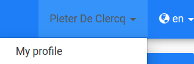
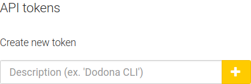
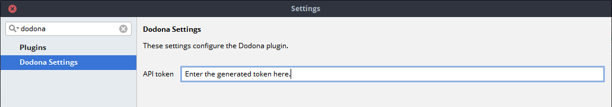

# Dodona
Plugin for JetBrains IDE's to submit exercises to Dodona.

## Generating an API token
These instructions can be used to generate a new API token, the plugin requires this in order to be able to submit exercises to Dodona.

### 1) Go to your profile page.

### 2) Click the edit button.

### 3) Scroll to the bottom of the page to generate a new token.

### 4) Paste the generated token in the plugin settings.
You can access the settings by selecting `Settings` in the `File` menu, or by pressing `Ctrl-Alt-S`.

## Credits
- Plugin initially developed by [Pieter De Clercq](https://thepieterdc.github.io/).
- Co-developed by [Tobiah_Lissens](https://github.com/darktilrisen).
- Thanks to [Rien Maertens](https://github.com/rien) for explaining the authentication procedure and other undocumented API questions.
- Icons are property of [FontAwesome](http://fontawesome.io).