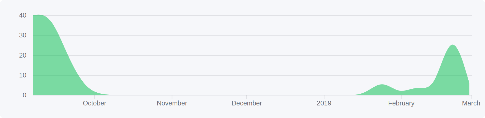
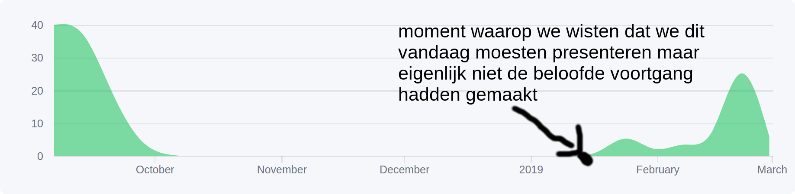

<!-- $theme: gaia -->
<!-- $size: 16:9 -->
<!-- *template: gaia -->

<link rel="stylesheet" href="../ourstyles.css" />

# Dodona Plugin
#### ==maandag 4 maart 2019==

---

<!-- page_number: true -->

# ==Oorsprong==
### Filosofische quote

---

<!-- *template: gaia -->

> Lost time is never found again.

&mdash;Benjamin Franklin

---

# ==Timeline==
###### september 2018

- Indienen met 1 klik
- Java

---

# ==Timeline==
###### september 2018

- Indienen met 1 klik
- Java
- Omslachtige user interface

---

# ==Ontwikkeling==
### Doorheen het semester

---

# ==Ontwikkeling==
## 

---

# ==Ontwikkeling==
## 

---

# ==Timeline==
###### maart 2019
- Indienen met 1 klik
- Boilerplate code downloaden
- Verbeterde feedback (syntaxfouten, te traag, ...)
- Java, Python
- JavaScript
- Opgave tonen
- Betere user interface

---

# ==Bugs/Features==
## <a href="thepieterdc.github.io/dodona-plugin-jetbrains">thepieterdc.github.io/dodona-plugin-jetbrains</a>

---

<!-- *template: invert -->
# ==Demo==
